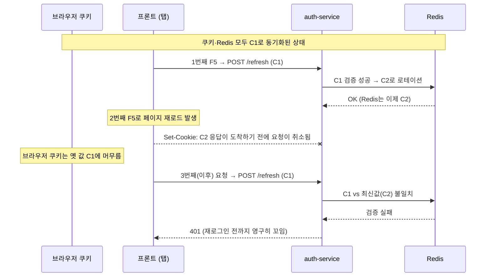
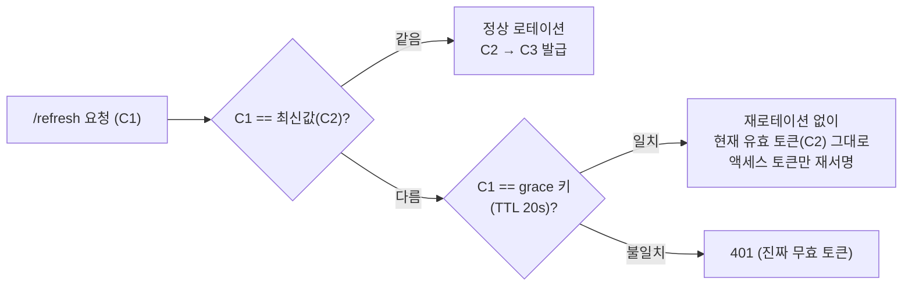

# 트러블슈팅: 새로고침 연타 시 강제 로그아웃

**문제발생**: 2026-08-19 
**연관 이슈**: issue `#328`

---

## 요약 — 원인은 하나가 아니라 두 개였다

마이페이지에서 F5를 빠르게 연타하면 로그인 상태인데도 `/login`으로 튕기거나 일부 정보가 빈 채로 표시되는 문제가 있었다. 한 번의 새로고침으론 재현되지 않고 **연타할 때만** 발생한다는 점이 단서였다.

먼저 리프레시 토큰 로테이션 과정에서 **페이지 이동이 서버 응답을 끊어버리는 레이스 컨디션**을 찾아 grace window로 고쳤다. 그런데 수정 후에도 "여전히 튕긴다"는 재현 보고가 이어졌고, 재조사 끝에 완전히 **별개의 결함**을 발견했다 — 프론트가 429(rate limit)를 401(인증 실패)과 구분하지 못하고 둘 다 무조건 로그아웃 처리하고 있었다. 두 원인을 각각 고치고 나서야 문제가 해소됐다.

---

## 1. 최초 증상

마이페이지(예약내역/상세/완료)에서 F5를 빠르게 연타하면:
- 로그인 상태인데도 `/login`으로 튕기거나
- 일부 정보가 빈 채로 표시됨

한 번의 새로고침으론 재현 안 되고 **연타할 때만** 발생.

---

## 2. 원인 ① — 리프레시 토큰 로테이션 레이스

### 배경

프론트는 액세스 토큰을 메모리에만 보관한다(XSS 방어를 위한 의도된 설계). 그래서 새로고침마다 `/refresh`로 세션을 복구해야 한다. 백엔드는 호출마다 리프레시 토큰을 로테이션한다(Redis 값을 새 토큰으로 덮어씀).

### ② 같은 페이지 로드 안 동시 호출 문제 — 이번 세션 이전에 이미 해결됨

App 부팅, `AccountLayout`의 뱃지 조회, 각 페이지의 재조회 로직이 동시에 각자 `refreshAccessToken()`을 호출하고 있었다. 리프레시 토큰이 호출마다 로테이션되다 보니 첫 번째 요청만 성공하고 나머지는 이미 무효화된 토큰으로 요청해 401을 받는 상황이 있었다. → `gateway.ts`의 `refreshInFlight`/`adminRefreshInFlight`로 요청 중복제거(singleflight)를 적용해, 같은 순간 여러 컴포넌트가 호출해도 실제 네트워크 호출은 하나만 나가게 이미 되어 있었다.

### ⑤ 페이지 이동이 요청을 끊는 경쟁 상태 — 이번 세션에서 해결

singleflight로는 못 막는 **다른 레이어**의 문제였다.

1. 1번째 새로고침의 `/refresh` 요청은 서버에서 이미 성공해 Redis가 새 값(C2)으로 덮어써짐
2. 그 응답(`Set-Cookie: C2`)이 브라우저에 도착하기 전에 2번째 새로고침으로 페이지가 재로드되며 요청이 취소됨 → 브라우저 쿠키는 옛날 값(C1)에 머무름
3. 이후 모든 `/refresh` 시도가 C1(브라우저) vs C2(Redis) 불일치로 계속 401 → 재로그인 전까지 영구히 꼬임

### 적용한 해결책 — 유예(Grace) Interval, #1

파일: `auth-service.service.ts`

- 로테이션 직전 "방금 버려질" 토큰을 `refresh:grace:{type}:{id}` 키(TTL 20초)에 잠깐 보관
- `/refresh` 요청의 토큰이 최신 값과 안 맞아도, grace 키와 일치하면 **재로테이션 없이** 현재 유효한 토큰을 그대로 재발급(액세스 토큰만 새로 서명) — 연쇄 로테이션 방지
- `logout`/`changePassword`/`withdraw`도 grace 키를 함께 삭제(로그아웃 직후 지연 도착한 구 토큰이 grace 구간 동안 계속 통과되는 구멍 방지)
- 절대 만료(#3)는 별도 이슈에서 처리하기로 하고 이번엔 제외, #2/#4는 보류 확정

curl로 실제 경쟁 상태(C1으로 재시도 → 재로테이션 없이 C2 재발급 확인)를 재현 테스트해서 고쳐졌음을 확인했다.

---

## 3. 원인 ② — 프론트가 "에러"와 "인증 실패"를 구분 안 함

원인 ①을 고친 뒤에도 "여전히 로그인창으로 튕긴다"는 재현 보고를 받고 재조사했다.

- 반복 테스트 중 api-gateway에서 **429(Too Many Requests)**를 직접 만남
- `/api/auth/refresh`를 포함한 마이페이지 6개 페이지가 전부 에러 종류를 안 가리고 `catch { navigate('/login') }` — 401이든 429든 네트워크 오류든 **무조건** 강제 로그아웃 처리하고 있었음
- 즉 grace 키 수정은 "토큰 꼬임"이라는 원래 버그는 고쳤지만, 429(rate limit) 같은 일시적 오류를 로그아웃으로 오인하는 **별개의 결함**이 남아있었던 것

### 적용한 해결책

파일: `gateway.ts` 외 7개 파일

- `ApiError`(HTTP status 포함) + `isUnauthorized(err)` 도입 — **401만** "진짜 로그인 필요"로 판별
- `fetchWithRateLimitRetry`: 429 시 `Retry-After` 헤더를 존중해 자동 재시도(없으면 지수 백오프+jitter). `ThrottlerGuard`가 핸들러 도달 전에 거부하므로 부작용 없이 모든 메서드에 안전하게 적용
- `bookings.ts`/`payments.ts`가 각자 갖고 있던 중복 fetch 로직을 `gateway.ts`의 `authorizedFetch`/`parseJsonResponse`로 통합(중복 제거 + 429 처리 일괄 적용)
- 마이페이지 6개 파일: `isUnauthorized(err)`일 때만 로그아웃, 그 외엔 `loadError` + "다시 시도" 버튼

---

## 4. 곁가지 조사 — 429의 정확한 원인

- **오해 정정**: 처음엔 "모든 라우트가 IP당 하나의 버킷을 공유한다"고 설명했으나, `@nestjs/throttler` 소스(`generateKey`)를 직접 확인해 실제로는 **라우트(컨트롤러+핸들러)별로 독립된 카운터**라는 걸 정정. 즉 429는 `/refresh` 자체가 F5 연타로 반복 호출되며 그 라우트 자체의 한도(100회/60초)를 소진한 것
- **DDoS 방어 여부**: `ThrottlerGuard`는 IP 기준이라 분산된 IP로 오는 진짜 DDoS는 못 막는다 — 이건 "남용 방지"이지 DDoS 방어가 아니다. 프론트(S3+CloudFront)는 AWS Shield Standard가 딸려오지만, 백엔드 API 쪽엔 WAF가 없다는 것도 확인했다.

---

## 5. 마무리 보완 — `/refresh` 전용 짧은 창 + 시간 예산 기반 재시도

실무 표준 조사(로그인/로그아웃/GET/POST별 rate limit 관행) 후, `/refresh`는 "짧은 창 + 상대적으로 높은 한도"가 표준이라는 결론에 도달했다.

- **`auth.controller.ts`**: `refresh`/`adminRefresh`에 `@Throttle({ default: { limit: 20, ttl: 10_000 } })` 추가 — 전역(100/60s)은 다른 라우트에 그대로 두고, 이 두 라우트만 회복 시간(`Retry-After` 최대값)을 60초 → 10초로 단축. limit도 창 길이에 비례해서 같이 줄여(20) 처리량 자체는 안 풀어줌
- **`gateway.ts`**: `fetchWithRateLimitRetry`를 "횟수 기준(3회)"에서 **"누적 대기시간 예산(30초) 기준"**으로 변경 — 429는 진짜 실패가 아니라 "기다리면 성공하는 상태"라, 예산 안에서는 화면에 알리지 않고 조용히 재시도. 예산을 넘겨야만 페이지의 에러 UI로 넘어감

---

## 6. 변경 파일 전체

| 파일 | 변경 내용 |
|---|---|
| `backend/apps/auth-service/src/auth-service.service.ts` | grace window (원인 ①) |
| `backend/apps/api-gateway/src/auth/auth.controller.ts` | `/refresh` 전용 짧은 rate limit |
| `frontend/src/api/gateway.ts` | `ApiError`, `isUnauthorized`, 429 재시도 |
| `frontend/src/api/bookings.ts`, `payments.ts` | 중복 fetch 로직 통합 |
| `frontend/src/pages/ReservationHistoryPage.tsx` | 401만 로그아웃, 나머진 재시도 UI |
| `frontend/src/pages/ReservationDetailPage.tsx` | 〃 |
| `frontend/src/pages/MyPage.tsx` | 〃 |
| `frontend/src/pages/PaymentsPage.tsx` | 〃 |
| `frontend/src/pages/PaymentDetailPage.tsx` | 〃 |
| `frontend/src/pages/PaymentsPendingPage.tsx` | 〃 |

> 참고: `frontend/src/api/gateway.ts`의 `refreshInFlight`/`adminRefreshInFlight` singleflight는 이번 세션에서 건드리지 않은, 기존에 이미 반영되어 있던 코드다.

### 검증

백엔드/프론트 각각 `tsc --noEmit`, 기존 유닛테스트(auth-service 7개, api-gateway auth 8개) 통과, eslint 통과, `npm run build` 통과, curl로 실제 레이스 시나리오 재현 확인.

---

## 7. 조치 현황 — 이번에 해결한 것 vs 다음으로 미룬 것

| 상태 | 항목 | 내용 |
|---|---|---|
| ✅ 해결됨 | 리프레시 로테이션 레이스 (#5) | grace window(TTL 20초)로 연쇄 로테이션 방지 |
| ✅ 해결됨 | 429를 401로 오인하는 프론트 결함 | `ApiError` + `isUnauthorized`로 판별, 401만 로그아웃 |
| ✅ 해결됨 | `/refresh` rate limit이 과하게 빡빡함 | 전용 짧은 창(10s/20회)으로 회복 시간 단축 |
| ✅ 해결됨 | 429 재시도가 화면에 노출됨 | 시간 예산(30초) 기반 조용한 재시도로 변경 |
| 🟡 보류 | #3 절대 만료 | 별도 이슈 처리 예정 |
| 🟡 보류 | #2 토큰 패밀리 + 재사용 탐지 | 보류 확정 |
| 🟡 보류 | #4 디바이스별 세션 분리 | 보류 확정 |
| 🟡 미착수 | 로그인 엔드포인트의 계정(이메일) 기준 브루트포스 방어 | 오늘 새로 발견한 갭, 별도 이슈로 넘기기로 함 |
| ⏸ 우선순위 낮음 | POST 생성 요청의 Idempotency-Key | — |
| ⏸ 우선순위 낮음 | 로그아웃 rate limit 예외 처리 | — |
| ⏸ 스코프 밖 | 관리자 화면의 `navigate('/admin/login')` 무조건 처리 패턴 | 언급만 함, 이번엔 미수정 |

---
*team04-hotel · auth-service / api-gateway / frontend 공통 이슈*
